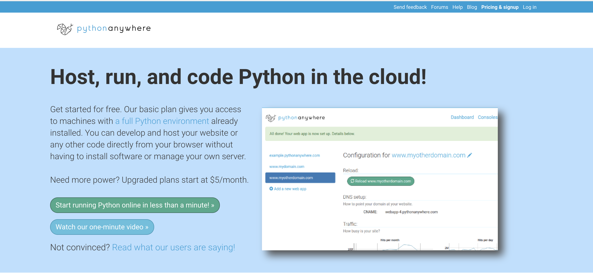
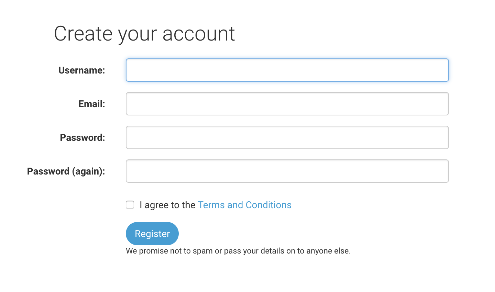
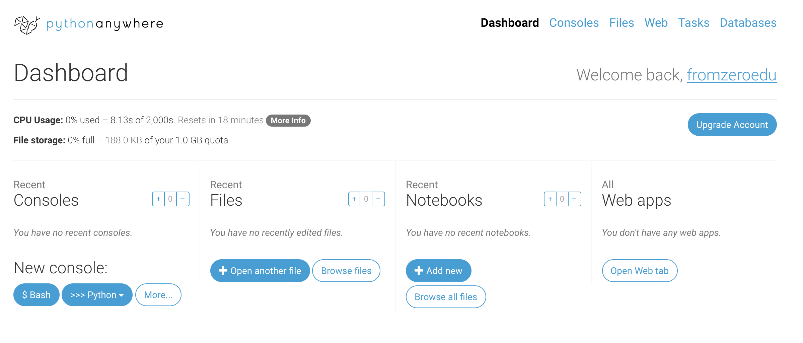

# Your Python Flask Development Environment <!-- 2.1 -->

Like I mentioned earlier, we have two options to setup our Python Flask Development Environment.

The first is to install Flask locally in your computer. That means you have administrator access and can install packages.

The second is to use an online python development environment. Here you will sign up to a cloud-based service where you can code from anywhere you like, your home, work computer or even an internet cafe. There’s no installation required.

Select the one that’s appropriate for you in the following lessons.

## Installing Python3 on Mac with Homebrew <!-- 2.2 -->

My favorite package manager for the Mac is [Homebrew](https://brew.sh) and that’s what we’ll use to install Python 3.

To install Homebrew just go the Homebrew website. Copy the code on the Homebrew homepage.

Now open a new terminal window. You can open the terminal by going to the Spotlight search and typing `terminal`.

Once the terminal window is open, paste the Homebrew code and press enter. Wait until all the files are installed.

To check that everything was properly installed do a `brew doctor`.

Now we’ll install Python3. As you know, Mac OS X comes with Python 2.7, but we want to be using Python 3.

To install Python 3, just type the following:
`brew install python3`

Wait until the script finishes.

To make sure Python 3 was installed properly, type `python3 -V`.

And that’s it. Now we can begin our course.

## Installing Python3 on Windows 10 with Chocolatey <!-- 2.3 -->

My favorite package manager for Windows is [Chocolatey](https://chcolatey.org) and that’s what we’ll use to install Python 3.

Head over to the [Chocolatey install page](https://chocolatey.org/install) and copy the code in there.

Now open a PowerShell terminal. You can find it by pressing `Windows+R` and then typing `PowerShell`. However, you need to run as administrator, so right-click on the window and on the menu select “Run as Administrator”.

Paste the code in the PowerShell windows and press enter. Wait until the program is installed.

Close the PowerShell window and open it again as an administrator. Remember: every time you use Chocolatey to install packages, you need to run Powershell as administrator.

Check that Chocolatey was installed properly by typing `choco -v`. If you see a version number, you’re ready to go.

Now to install Python3, just do:
`choco install -y python3`

Close and reopen Powershell as administrator to make sure the Path settings for the Python package are applied.

To make sure Python 3 was installed properly, type `python -V`.

And that’s it. Now we can begin our course.

## The Cloud-based Python Development Environment <!-- 2.4 -->

I’m constantly searching for the best Python cloud development environment and I keep coming back to PythonAnywhere. They are completely free but have really good plans, they have amazing customer service and they have MySQL and Postgres support built in.

In this lesson we will look at how we create our PythonAnywhere account.

To start the process, please use the following [referral link](https://www.pythonanywhere.com/?affiliate_id=0036e046).

To be fully open, with this link I get a small commission if you sign up for a paid plan and this helps me continue to bring you more good content. Thanks in advance!

When you land on the page, you will see a welcome page. Click on the green button to start the process.



Here you will be presented with the different plans. For the purposes of this course, the beginner account is more than enough. If you’re thinking of hosting a personal site with your own domain or want better speed and performance, choose any of the paid plans.

So go ahead and create the account. You will be asked for a username, email and password.



Make sure to confirm your email with the link they’ll send you.

And that’s it — you will arrive to the Dashboard. Don’t worry about this yet, we’ll start covering how to do all the stuff in the coming sections.



## Virtual Environments <!-- 2.5 -->

One of the fundamental tools of your Python development environment is the concept of virtual environments or _virtualenvs_.

Think of a virtual environment as an enclosure in your computer where you can install Python and additional libraries, as well as your own code, without interfering with your computer in general as well as with other projects. So each project you work on is going to have its own virtual environment.

Why is that important? Because each project you work on will use different libraries and different _versions_ of those libraries. If you installed these libraries across your computer, a newer version of a library could overwrite an older one. And sometimes you _don’t want_ to use the newer one for compatibility purposes, until, let’s say, you change something in your code.

So let’s go ahead and create our first project’s folder and virtual environment. Since PythonAnywhere’s handling of web apps is different, please skip to that section.

### Windows and Mac Virtualenv Setup <!-- 2.5.1 -->

One thing that I recommend is that you put all your projects in one folder in your computer. It’s not a good practice to just have projects lying around in different folders in your computer.

For historical Unix reasons that you can research on your own, custom applications have typically been installed in the `/opt` folder. So let’s check if you have an `/opt` folder. 

- In Mac type: `ls -al /`.
- In Windows type: `ls C:\` or whatever the drive letter you use. Please note we will be using Windows Powershell as our Windows terminal.

If you have the `/opt` folder, that’s great. If you don’t you can create it using:

- Mac: `mkdir /opt`
- Windows: `mkdir \opt`

If you get an error about administrative issues on Mac, use the `sudo` command, like this: `sudo mkdir /opt`. You’ll need the administrative password for that. Then make sure to change the ownership to your regular user. You can see your user by typing `whoami` and then doing `sudo chown youruser /opt`.

Ok, now that that’s done, change to that directory using `cd /opt` in Mac or `cd \opt` in Windows. Make sure you’re in that directory by typing `pwd` and checking the path.

Now let’s create a folder called `simple_flask_app`. So do: `mkdir simple_flask_app` and change to it with `cd simple_flask_app`.

Now we’ll install our virtualenv. Do the following:

- Mac: `python3 -m venv venv`
- Windows: `python -m venv venv`

This will create a folder called `venv` where all packages will be installed after you _activate_ your virtual environment.

### PythonAnywhere Virtualenv Setup <!-- 2.5.2 -->
Because PythonAnywhere has restrictions on the user’s permissions, we’ll need to create our directory using PythonAnyhwere’s custom setup.

First, let’s create a directory where we’ll install all our apps. Normally I would use `/opt` but since we don’t have admin access, we’ll just create one in our home directory. So make sure you’re in your home directory and then create a `/opt` folder here and inside of that, our `simple_flask_app` folder.

{lang=bash,line-numbers=off}
```
$ mkdir opt
$ cd opt
$ mkdir simple_flask_app
```

Now we’ll create our virtualenv for our application. So use the following command:

{lang=bash,line-numbers=off}
```
$ mkvirtualenv simple_flask_app -p python3.6
```

This will create a folder in your home directory that looks like the following:
`/home/your_username/.virtualenvs/simple_flask_app`

Write down that path somewhere, as we’ll need it in a future step.

Now just type `deactivate` so that you can log out from your virtualenv.

### Activation and Deactivation <!-- 2.5.3 -->

For your virtualenv to be _active_ you need to type a command to _activate_ it. Activating it makes the computer think that the “main” folder to install things in is our `venv` folder and not the root computer’s folder. 

So how do we activate it? Simply do:

- Mac: `source venv/bin/activate`
- Windows: `venv\Scripts\activate`
- PythonAnywhere: `workon simple_flask_app`

Notice that now you have a `(venv)` prompt or `(simple_flask_app)` prompt in your folder path. 

Not activating the virtualenv is one of the main sources of issues for new developers. So before coding or installing anything, make sure you see that prompt, otherwise activate your virtualenv.

To deactivate, just type `deactivate` in all platforms. Notice how the `(venv)` prompt disappeared.

Now we’re ready to install Flask.

## Installing Flask <!-- 2.6 -->

It’s time to install Flask for our project. Since we don’t want Flask to be installed system-wide, we’ll use our virtualenv.

So make sure to change directory to your project directory by doing:

- `cd /opt/simple_flask_app` in Mac, 
- `cd \opt\simple_flask_app` in Windows or
- `cd ~/opt/simple_flask_app` in PythonAnyhwere.

Now remember, at this point, we need to activate the virtualenv, otherwise we’ll install Flask for all users in our computer, so do:

- Mac: `source venv/bin/activate`
- Windows: `venv\Scripts\activate`
- PythonAnywhere: `workon simple_flask_app`

Make sure you see the virtualenv label in parenthesis at the beginning of the terminal prompt.

So how do we install packages in our virtual environment? For that use use the `pip` library. Pip is the Python package index and it has thousands of open source packages available for you to use. From Twitter API connectors, to web scrapers to web frameworks… it’s really one of Python’s greatest tools.

Pip allows you to install specific versions of these libraries using a version number. Why is that important? The main issue is that as developers upgrade their libraries with more features, sometimes those changes can become an issue for our code, as they might change the way you interact with the library. There’s also issues if we have more than one library and they talk to each other. So we’ll be using version numbers for all the libraries we’ll install in our projects.

And Flask is no exception, so let’s install Flask version 1.0.2 in our virtual environment. So type:

{lang=bash,line-numbers=off}
```
$ pip install Flask==1.0.2
```

