# Say Hello World

## The Code Editor <!-- 3.1 -->
We’re finally ready to build our first Flask application. Well, it’s not going to be technically an application, but it will introduce us to some fundamental concepts, so that we’re ready to start building real applications.

At this point, if you are working with Mac or Windows, you’re going to need a code editor. If you use PythonAnywhere, don’t worry, you will be using their built-in code editor.

There are many good options for code editors. Some of the most popular include Sublime Text, PyCharm and Visual Studio Code. I definitely recommend to try out some of them when you have the time and see which one you feel most comfortable with.

However, for this course, I’ll be using Atom. Atom is really simple and powerful at the same time and I’ve been using it for some time, so I feel comfortable with it. 

So go ahead and install your code editor and we’ll start building our “Hello World” application next.

## Hello World <!-- 3.2 -->

So let’s create a file inside our `simple_flask_app` folder. But first, we need to activate our virtual environments.

For Mac, open the terminal and `cd` to `/opt/simple_flask_app`. Then do `source venv/bin/activate` to activate virtualenv.

On Windows do `cd \opt\simple_flask_app`, then do `venv\Scripts\activate`

On PythonAnywhere do `cd ~/opt/simple_flask_app`, then do `workon simple_flask_app`.

From this point on, when I say “activate your virtualenv”, please follow the previous instructions for your current operating system.

Now we’ll create a new file called `hello.py` with our code editor inside the `simple_flask_app` folder.

For Windows and Mac type `atom .`. This will open the Atom editor with this folder selected. 

If you’re on a Mac and that command throws an error like “Atom was not found”, just make sure to quit the Atom application, open it again, and select “Install Shell Commands”.


So how do we create `hello.py`?

On Windows and Mac, select the `simple_flask_app` folder first with your mouse and then hit the `a` key. On the input field type `hello.py`. Note that your folder might have "contracted". Just click it again to expand it and see the contents.

On PythonAnywhere hit the "hamburger" icon on the top right, and select "Files".


Then locate the `opt/` folder on the Directories section, click on it and then click on the `simple_flask_app` link. Make sure you have the full path `/home/` your username, `/opt/simple_flask_app` on the top left.


Finally on the “Files” section, enter “hello.py” and click on the “New file” button.


Okay, we’re ready to start coding our first Flask application!

On the first line type:

{lang=python,line-numbers=on,starting-line-number=1}
```
from flask import Flask
```

This imports the Flask class in our file.

We now need to create an instance of the class. We’ll call that object “app”:

{lang=python,line-numbers=on,starting-line-number=2}
```
app = Flask(__name__)
```

Notice we pass `__name__` as a parameter. This is a Python built-in magic variable that tells Flask which module or package this is running from. This allows Flask to know where to look for related folders of our application.

Leave an empty line and now type:

{lang=python,line-numbers=on,starting-line-number=4}
```
@app.route('/')
```

The @ sign here is called a “decorator”, and essentially this allows us to modify the function we’ll type underneath. We’ll learn more about decorators later on.

The “route” decorator tells Flask what URL this function will be called on. In this case this will be the root folder or “/“.

We now create our function, which just returns “Hello World” back to the browser:

{lang=python,line-numbers=on,starting-line-number=5}
```
def hello_world():
    return 'Hello, World!'
```

And that’s it! This is what the whole file looks like:


In the Atom editor, notice how there’s a little blue circle on the tab? That means this file hasn’t been saved. Hit “CTRL+s” on Windows or “Command+s” on Mac to [save it](https://github.com/fromzeroedu/itfc-simple-flask-app/blob/step-1/hello.py).

On Python Anywhere, notice how it says “unsaved changes” on the top next to the file’s path. Hit the green “Save” button to save the file.

Now we’ll see how to run this application and see it in our browser. We have two different lessons depending if you’re in Windows or Mac, or if you’re in PythonAnywhere. Skip to the one that’s right for you.

## Running the Application (Windows and Mac) <!-- 3.3 -->

Let’s see how we run the application on Windows or Mac.

Once again, make sure to have your virtualenv activated, so that the word `(venv)` appears on the command prompt. If it doesn’t, activate it.

To be able to run the application, we first need to set an environment variable to tell Flask what application we want to run and then use the `flask run` command.

In Windows Powershell, set the environment variable with the following command:

{lang=bash,line-numbers=off}
```
$env:FLASK_APP = "hello.py"
```

In Mac OS, you set it by doing:

{lang=bash,line-numbers=off}
```
export FLASK_APP=hello
```

We can now run the application by typing the following command:

{lang=bash,line-numbers=off}
```
flask run
```

Now open your browser and type this URL: `http://127.0.0.1:5000/`

That `127.0.0.1` is also called localhost and it’s a special IP address that points back to your own machine.

You should now see the string “Hello, World!” appear in your browser.

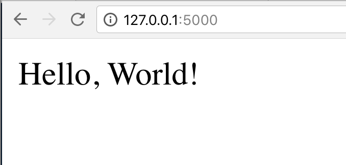

That’s it, our first Flask application!

Stop the application by going back to the terminal and hitting “CTRL-C” on the running task.

Keep in mind that the `FLASK_APP`environment variable will be erased when you close your terminal, so if you stop here or restart your terminal or computer, you need to set the environment variable again. We will see how we can do this automatically later in the course.

## Running the Application (PythonAnywhere) <!-- 3.4 -->

To run our application on PythonAnywhere, we need to register a web app on their system.

So from the navigation menu click on “Web” and you will land on this screen.

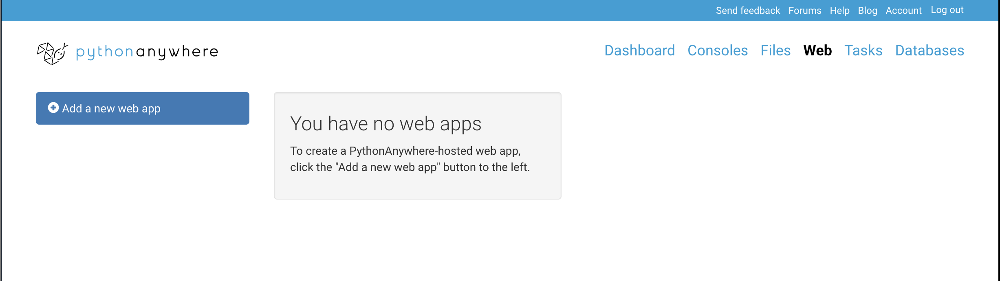

Click on the “Add a new web app” button. You will be notified of the URL that has been assigned to you. Usually this is your username, dot, pythonanywhere dot com. For free accounts that’s the only option. Paid accounts can use custom URLs. Click “Next”.

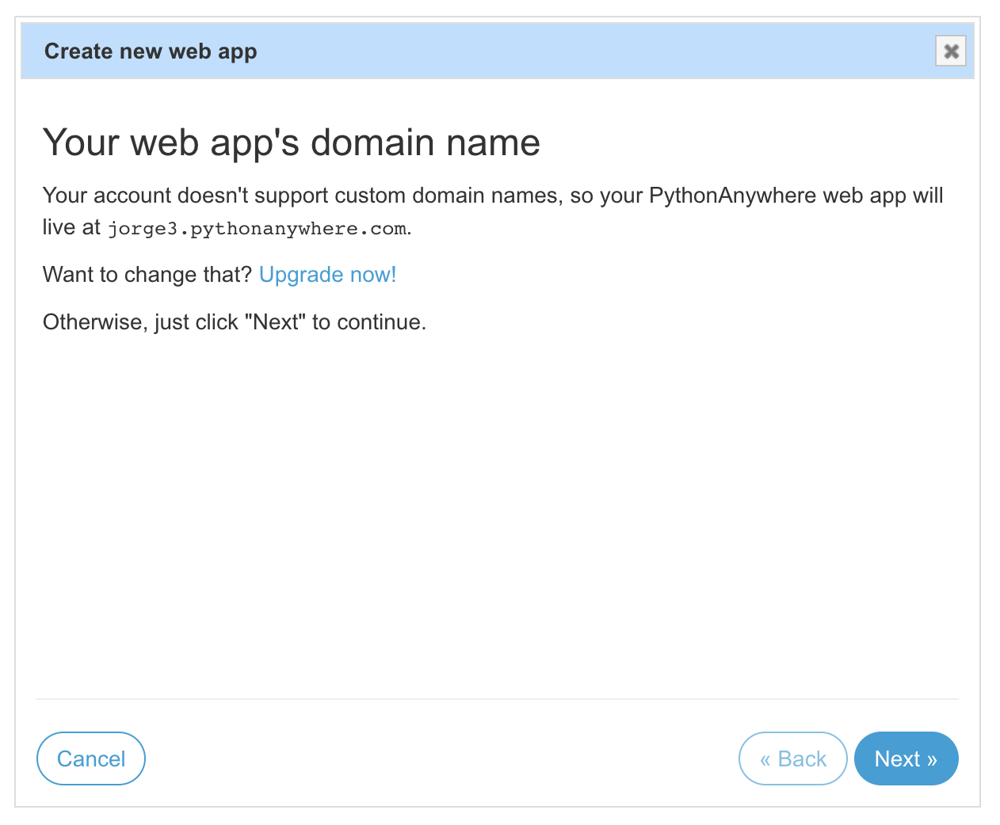

In the next screen you select a Python Web framework. Since we installed Flask ourselves via our virtualenv, select “Manual configuration".

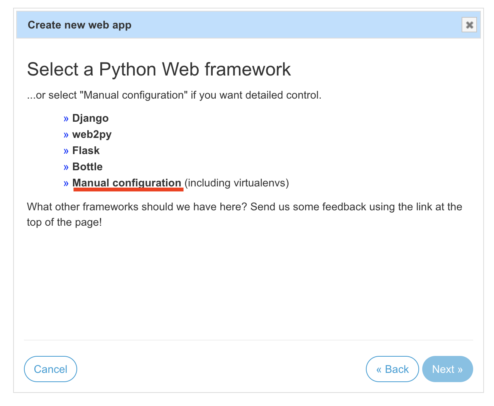

The next screen asks what Python version to use. Select “Python 3.6” and click “Next”.

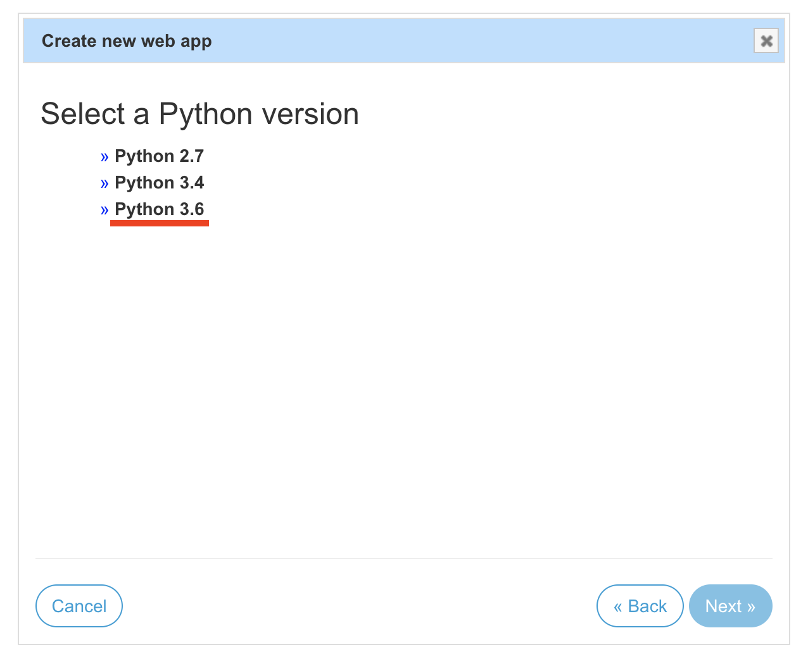

The next screen talks about the creation of a WSGI configuration file. Don’t worry too much about what WSGI means now, just think of it as a file that tells the PythonAnyhwere server which application should be associated with your URL. PythonAnywhere will create a default WSGI file for you to edit on the next screen. Click “Next”.

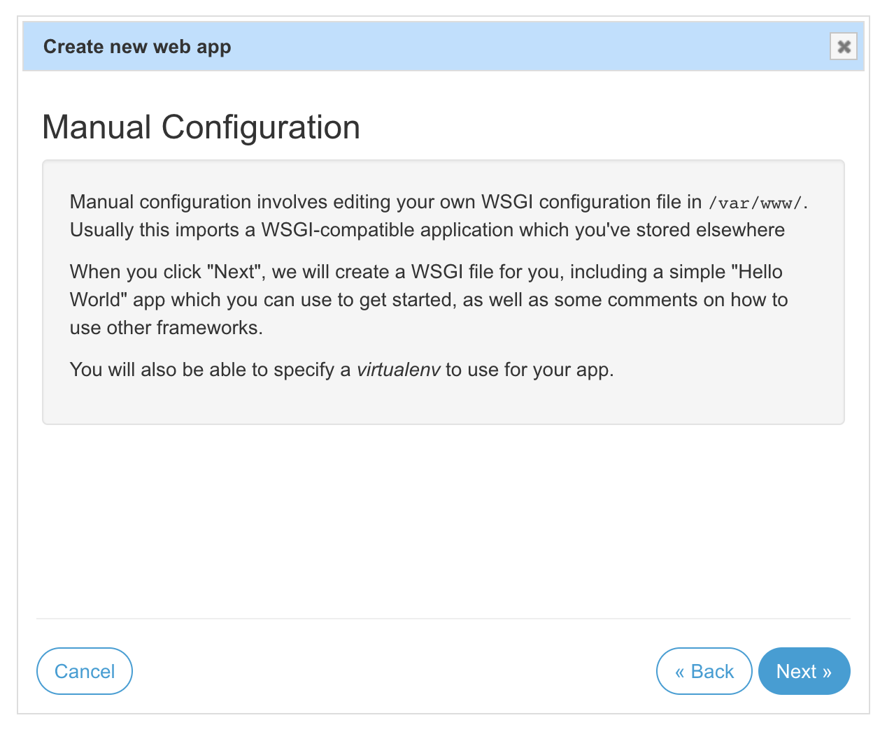

Now we’re into the “Configuration” page. There are some things to do here.

First, notice the “Best before date” section. If you have a free plan, that means that at least once every three months you need to press that yellow button that reads “Run until 3 months from today”. PythonAnyhwere does this to make sure users that are using the servers are actively doing so.

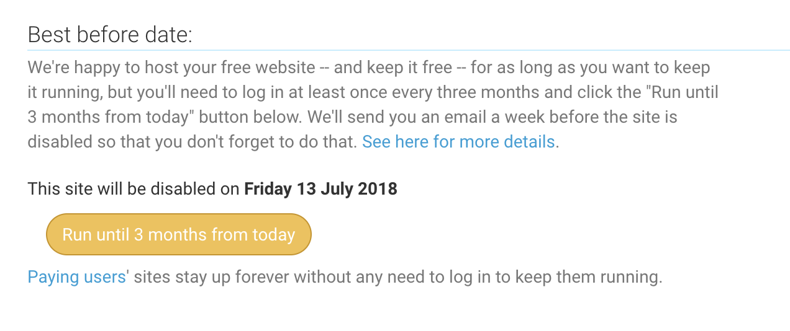

Next, on the “Code” section you need to select the “Source code” directory. Click on the blue link and enter the following path, replacing the `username` with your own username:

{lang=bash,line-numbers=off}
```
/home/your_username/opt/simple_flask_app
```

Next on the “WSGI configuration file” you’ll need to replace the file contents with the following code. Just click on the blue link and enter this snippet, replacing the _username_ with your own username. [Save the file](https://github.com/fromzeroedu/itfc-simple-flask-app/blob/step-1/pa_wsgi.py).

{lang=python,line-numbers=on,starting-line-number=1}
```
import sys
python_anywhere_username = 'jorge3'
path = '/home/' + python_anywhere_username + '/opt/simple_flask_app'
if path not in sys.path:
    sys.path.append(path)

from hello import app
app.debug = False

from werkzeug.debug import DebuggedApplication
application = DebuggedApplication(app, evalex=True)
```

We’re almost done. Now head over to the “Virtualenv” section and select the blue link and just type “simple\_flask\_app”. PythonAnywhere will auto-complete with the full path when you hit enter.

So the whole thing should look like this, but with your own username.

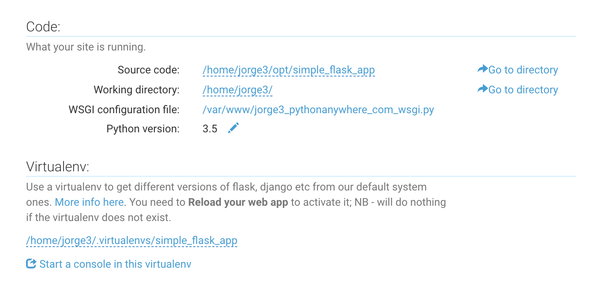

Finally, go to the top of the page and click on the green button on the “Reload” section.

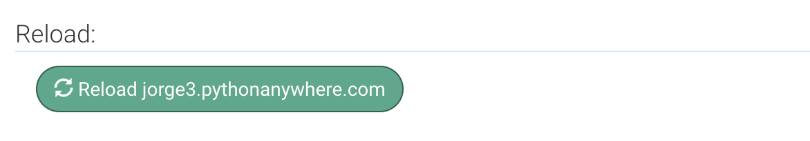

Now click on the blue URL on the top or enter “yourusername.pythonanywhere.com” in the browser. You should see the “Hello, World!” text.

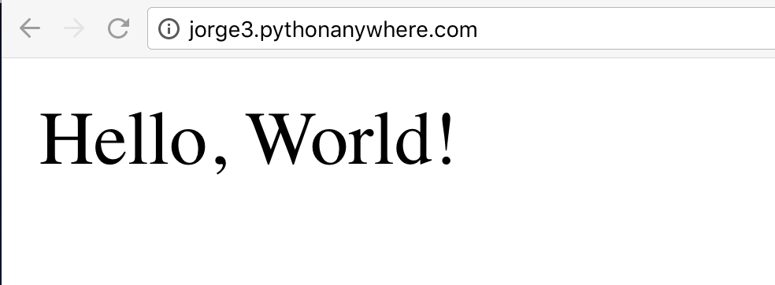

If something didn’t work, just re-check the steps and make sure you’re not missing something. It’s usually some silly small detail you missed.

## Debugging our application <!-- 3.5 -->
One of the things you’ll spend the most time on as a software developer will be finding issues with your and your team’s code, also known as “bugs”.

Debugging mode is a parameter you pass to the Flask environment so that when it encounters an unexpected error, it gives you more information about the conditions that triggered that issue.

As you might already know Flask runs on top of Python with other libraries assisting. If you visualize your application at a certain moment of time, you’d see sort of a stack of pancakes and when an error occurs, you need to see a cross cut of all the errors from your code all the way to Python. That’s why when an error occurs you will be presented with what’s called the “error stack”.

To turn on debugging mode we will set a configuration parameter called “Debug” on Flask. 

There are two ways to do this, one for Windows and Mac, and the other on PythonAnywhere. Skip to the section that applies to you.

### Debugging on Windows and Mac <!-- 3.5.1 -->
Open your terminal, activate your environment and do the following:

Windows: `$env:FLASK_DEBUG = 1`
Mac: `export FLASK_DEBUG=1`

Finally restart Flask by doing `flask run`.

Now we’ll introduce an error on purpose. On line 6 insert the following:

{lang=python,line-numbers=on,starting-line-number=6}
```
x = 1 + 'a'
```

This will produce a string plus integer error. Save the file[^1] and then reload the `127.0.0.1:5000` page on your browser.

### Debugging on PythonAnywhere <!-- 3.5.2 -->
To turn on debugging mode in PythonAnywhere, you need to edit the WSGI file on the Web Code section of the dashboard, and set the `app.debug` setting on line 8 of the file to “True”:

{lang=python,line-numbers=off,starting-line-number=8}
```
app.debug = True
```

Save the file[^2].

Now go back to your `hello.py` file. We’ll introduce an error on purpose. On line 6 insert the following:

{lang=python,line-numbers=on,starting-line-number=6}
```
x = 1 + 'a'
```

Save the file[^3].

On PythonAnywhere there’s a handy reload server button on the file editor. 

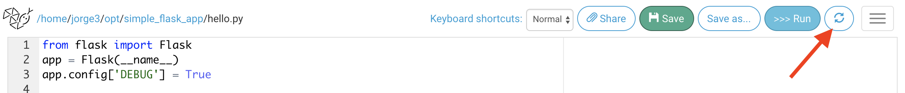

I suggest when you work with PythonAnywhere, you have two tabs open on your browser: in one you’d have your code editor and on the other your public webpage. Whenever you do a code change, save the file, hit the “reload servers” button and then go the tab with your application and reload the page.

One word of caution. When you’re done debugging, I suggest you turn debugging mode off. Do not leave this setting on for extended periods, as malicious hackers can potentially extract information about your codebase by looking at the debugging stack trace.

## The Debug Stack <!-- 3.6 -->
When you reload the page, you’ll see something like this:

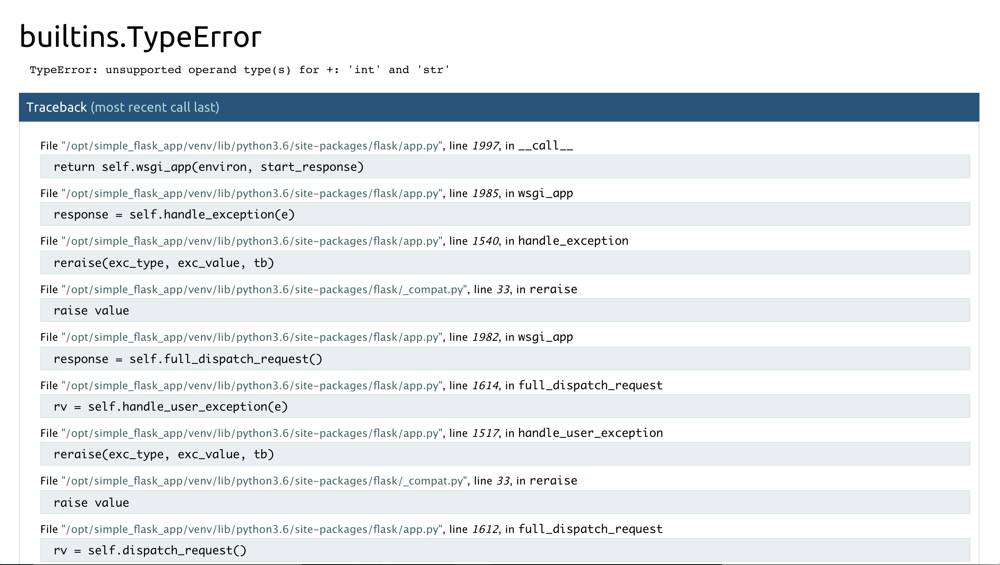

It’s a long page, and as you scroll down you will see the error pointed out at the bottom:

```
TypeError: unsupported operand type(s) for +: 'int' and 'str'
```

If you see a little above that, you’ll see that Flask tells you the line number and statement that produced the error.

```
File "/opt/simple_flask_app/hello.py", line 6, in hello_world
x = 1 + 'a'
```

Sometimes you’ll get lucky like this and the line with the issue is at the end. Other times it’ll be in the middle. Even though you don’t understand all the errors in all the stacks, you have to try to search for the code you wrote, and ignore the ones about other libraries. This is more art than science, but as you practice, you get better at it.

Before we move to the next lesson, go ahead and delete line 6, so that our application is back to normal. Remember to save the file.

[^1]:	https://github.com/fromzeroedu/itfc-simple-flask-app/blob/step-2/hello.py

[^2]:	https://github.com/fromzeroedu/itfc-simple-flask-app/blob/step-2/pa\_wsgi.py

[^3]:	https://github.com/fromzeroedu/itfc-simple-flask-app/blob/step-2/hello.py

## Templates <!-- 3.7 -->
As you build your application, the pages we return to the user will start getting more and more complicated. It would get pretty messy if you had each function with a return variable several dozen lines long.

So most web frameworks work using a design pattern called Model-View-Controller, or MVC.

Design patterns are a topic for another course, but just know that there are some best practices to approach computer problems that are well known, so that you don’t have to reinvent the wheel. As your career advances, it’s good to get acquainted with them. So write that down on your reading list.

Back to MVC, this pattern basically advocates that your application is divided into three main components.

- A Model, which is a file or set of files which are dedicated to reading and writing from your database
- A View, which is a file or set of files that deal with the presentation layer. In Web Applications, this would be HTML, CSS and JavaScript
- And a Controller, which is the file or set of files that coordinate the user requests and loads and saves data using the models and presents it back using the views

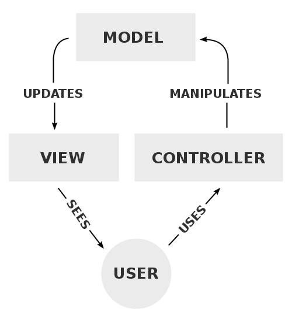

In Flask, the Views of the MVC model are handled by _templates_. Templates are files that have as their input a set of variables called a _context_ and usually outputs HTML.

So let’s go back to our script. You should have your virtual environment activated and have Flask running.

Let’s create a `templates` folder. Flask has a couple of special  directories that it looks for in every application and `templates` is one of them.

In Windows and Mac, go to your Atom editor, select the `simple_flask_app` folder and hit “Shift-A”. You will see a popup that allows you to enter the name of the folder. Enter `templates`. When you hit the folder the first time, it might contract and not show the folders. Just click on it again to expand. You should now see the templates folder in there.

In PythonAnywhere, go to your “hamburger” menu on the top right and select “Files”. On “Directories”, select “opt” and then “simple\_flask\_app” and then enter “templates” on the “Directories” section and click on the “New directory” button.

We will now create an HTML file for the index page. 

In Windows and Mac, click on the `templates` folder and now hit “a”. You will see a popup to enter the name of a new file inside the `templates` folder. You will see the directory in the input field. Make sure to write after it “index.html” and press enter.

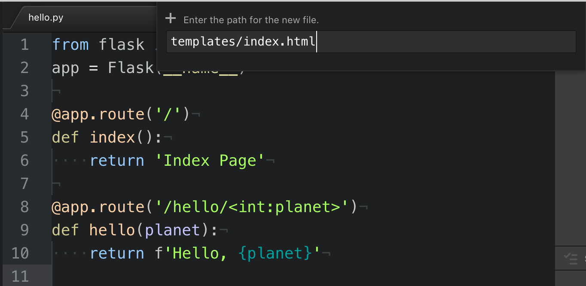

In PythonAnywhere you should still be on the Files tab. Make sure the path on the upper left says “/home/_your\_username_/opt/simple\_flask\_app/templates”, and then write “index.html” on the “Files” section, and then click the “New file” button.

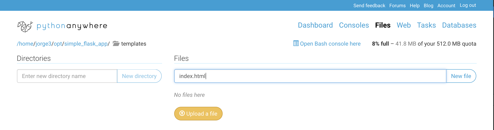

We can now enter some HTML content in here. So let’s just write the following:

```
<h1>Index Page</h1>
```

The `h1` open and closing elements denote that the string `Index Page` is a header level 1, which is the largest. Notice how the first element doesn’t have a slash and the second one does? This tells HTML that the first is the _opening_ tag and the second is the _closing_ tag.

I won’t go into detail on HTML, but if you follow along you’ll get the hang of it. You can also read a quick [introduction to HTML](https://www.w3schools.com/html/html_intro.asp) in the [w3schools.com](https://www.w3schools.com) website.

Save the file and now go back to the `hello.py` and instead of returning the `Index Page` string on line 6, we’ll do the following:

{lang=python,line-numbers=on,starting-line-number=6}
```
return render_template('index.html')
```

One last thing. On line 1, we need to import the `render_template` function, so after the `import Flask` add a comma and add `render_template`, so that the whole line looks like this:

{lang=python,line-numbers=on,starting-line-number=1}
```
from flask import Flask, render_template
```

Now save the file[^1] and head over to your root URL. Make sure it’s the one without any parts after the slash. You should see the Index Page displayed on the browser.

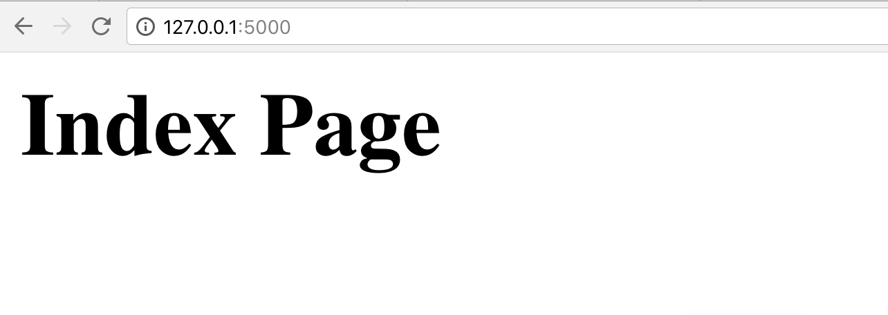

In PythonAnywhere, remember you need to save and then click on the reload server button. Once the reload is completed, go to your site’s tab and navigate to the root URL.

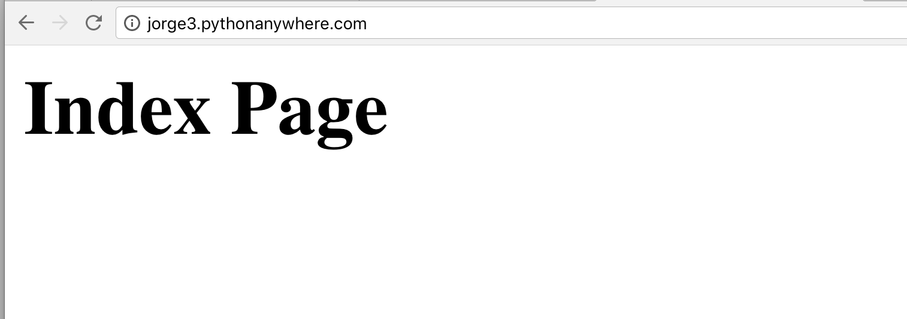

As you can see, the user sees what we wrote in the HTML file and now we can let that file handle anything output related and keep all the routing and logic in the Python file.

But now let’s see how we can pass information down to the template based on the user’s input. The variables passed to the template are collectively called _context_.

In the second route we have the `hello(planet)` function that outputs whatever number the user wrote on the second part of the URL.

So let’s create another template on the templates folder. We’ll do `hello.html` with the following HTML:

{lang=html,line-numbers=on,starting-line-number=1}
```
<h1>Hello, {{ t_planet }}</h1>
```

I called it `t_planet` to make it clear this is the template’s `planet` variable. Notice how we use double curly brackets instead of the one we use for the `f` string.

Now the template will print whatever the value of `t_planet` it gets in the context.

So how do pass the context to the template? Modify line 10 with the following:

{lang=python,line-numbers=on,starting-line-number=10}
```
return render_template('hello.html', t_planet=planet)
```

We’re assigning the template’s `t_planet` variable to the value of the `planet` variable we get from the URL part.

Save both files[^2] and head over to that URL using any number you want. Now try changing the number to something else and pressing enter. You’ll see the `Hello` output changes.


[^1]:	https://github.com/fromzeroedu/itfc-simple-flask-app/blob/step-7/hello.py

[^2]:	https://github.com/fromzeroedu/itfc-simple-flask-app/tree/step-8

## The url\_for() Function <!-- 3.8 -->
One thing you will do often in your templates and controllers will be to put links to other pages.

So for example, let’s add a link from the index page to the hello page in our application.

Modify the `index.html` by adding the following link on line 3:

{lang=html,line-numbers=on,starting-line-number=3}
```
<a href="/hello/4">Hello</a>
```

This HTML tag is called ‘a’ or ‘anchor’ and it allows you to link the current page to another page.

Save the file[^1] and head over to the index page. You should see this:

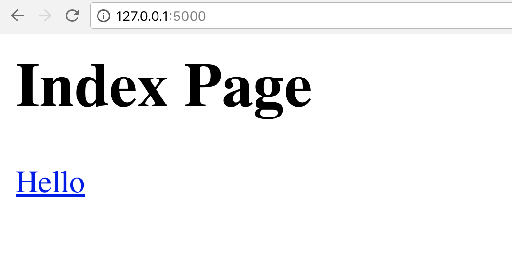

If you click on the “Hello” link, you’re taken to the hello route.

But let’s say now we figure out that we want to change the URL of that function to “greeting”. So on line 8 go ahead and change the route to read:

{lang=python,line-numbers=on,starting-line-number=8}
```
@app.route('/greeting/<int:planet>')
```

Save the file[^2] and on your browser go to the index page and click on the “Hello” link. You will get an error.

Now it would be easy to just update the `hello.html` template with the new `/greeeting` URL. But more often than not, you will have dozens or hundreds of links like this in your application.

So instead of hardcoding the URL, Flask provides a function called `url_for` that allows us to tie the URL with the function _name_ instead of the _route_, as function names will not change as much.

So let’s do that. Go to the `index.html` and replace the `href` with the following:

{lang=html,line-numbers=on,starting-line-number=3}
```
<a href="{{ url_for('hello', planet=4) }}">Hello</a>
```

Save the file[^3] and go to the index page on the browser and reload.

If you hover over the link and look at the address on the lower bar of the browser, you’ll notice the URL is properly coded. Click on it and you’ll get to the “hello” page with no errors.

Now go back to the `hello.py` file and change the route back to `hello`, like so:

{lang=html,line-numbers=on,starting-line-number=8}
```
@app.route('/hello/<int:planet>')
```

Save the file[^4] and reload the Index page. You will see the link works perfectly fine and now generates the updated URL automatically.


[^1]:	https://github.com/fromzeroedu/itfc-simple-flask-app/blob/step-9/templates/index.html

[^2]:	https://github.com/fromzeroedu/itfc-simple-flask-app/blob/step-10/hello.py

[^3]:	https://github.com/fromzeroedu/itfc-simple-flask-app/blob/step-11/templates/index.html

[^4]:	https://github.com/fromzeroedu/itfc-simple-flask-app/blob/step-12/hello.py

## The Static Folder <!-- 3.9 -->
There are certain files that don’t need to be processed by our controller, because they’re always the same. The majority of these are presentation-centric files, like CSS or JavaScript files that improve the user interaction.

Flask reserves a folder for these called `static`, and just like the `templates` folder, it’s a special folder.

We won’t dive too much on these types of files in this course, but let’s say we want to make the text we have a little prettier on our site. CSS files allow us to do that by assigning fonts and color to our tags.

So create a `static` folder on the app’s root, just like we did with `templates`.

Now inside the folder, create a file called “base.css” and enter the following:

{lang=css,line-numbers=on,starting-line-number=1}
```
h1 {
  color: red;
  font-family: Verdana;
}
```

This will make our `h1` tags to be red and with a Verdana font.

Save the file[^1] and now let’s change our `index.html` to include the new `base.css` file. We can do that by changing the file to look like the following.

{lang=html,line-numbers=on,starting-line-number=1}
```
<html>
<head>
  <title>Index Page</title>
  <link rel="stylesheet" href="static/base.css" />
</head>
<body>
<h1>Index Page</h1>

<a href="{{ url_for('hello', planet=4) }}">Hello</a>
</body>
</html>
```

Here we have a more standard HTML file. All HTML files should declare themselves as HTML with the `<html>` opening and closing tags, then define a header section that contains information about the page and helper files, like CSS or Javascript and defined with the `<head>`opening and closing tags and finally a main body where the content goes, defined by the `<body>` opening and closing tags.

Save the file[^2] and reload your browser. It should look like this:

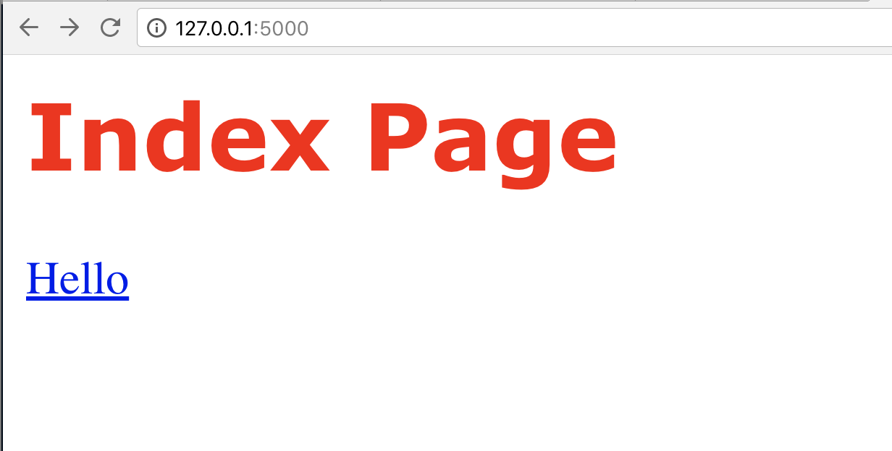

If for some reason it doesn’t, it’s because static files are often cached by the server and the browser. Quit your browser and restart the `flask` server and open the url again.

Even though this is technically working, there’s a potential issue here. Just like the page URLs can change, the location of the static folder can also change. The application can point to another directory within the server or another server altogether.

For that, Flask has a special `url_for` method that will set the proper URL for your application, so you don’t have to worry about that.

So on `index.html` change the stylesheet line to look like the following:

{lang=html,line-numbers=on,starting-line-number=4}
```
<link rel="stylesheet" href="{{ url_for('static', filename='base.css') }}" />
```

Save the file[^3] and reload the browser. You should see the same output, but your `base.css` file URL is now dynamically generated.

[^1]:	https://github.com/fromzeroedu/itfc-simple-flask-app/blob/step-12/static/base.css

[^2]:	https://github.com/fromzeroedu/itfc-simple-flask-app/blob/step-12/templates/index.html

[^3]:	https://github.com/fromzeroedu/itfc-simple-flask-app/blob/step-13/templates/index.html

## Template inheritance <!-- 3.10 -->
If you’re still on the index page of the application and click on the “Hello” link, you’ll notice our “Hello” page’s title didn’t change to red like the one on `index.html`.

That’s because our `hello.html` file is not including the CSS static file.

Now we could copy and paste all the HTML we did for the index page, but you can see how this could be problematic and violates the DRY principle: don’t repeat yourself.

Flask knows this and it features something called “Template Inheritance” which allows us to create common templates with sections that can be overridden by the active template, sort of how class inheritance works.

Let’s see how we do that.

First, we’re going to define a “base.html” file that is going to be the basic template for all of the templates. Go ahead and create `base.html` as an empty file on the templates folder.

Now go ahead and cut from `index.html` the first 6 lines and the last two lines, leaving only the `<h1>` and the `<a href>` lines and paste them on `base.html`[^1].

Now we need two steps for the template inheritance to work.

First on `index.html` we need to _extend_ the `base.html` template. For that we insert the following statement on line 1:

{lang=html,line-numbers=on,starting-line-number=1}
```

```

Now when `index.html` is rendered, it will use `base.html` as its parent. But now we need to tell Flask where the content of `index.html` will be inserted on `base.html`.

That’s the second step, and it has two parts. 

First, in `base.html` Between the `<body>` tags insert the following:

{lang=html,line-numbers=on,starting-line-number=8}
```

```

What this line is saying is that templates that extend this template can insert content in here using the `content` identifier.

Now on `index.html` we need to wrap the whole code with the same block:

{lang=html,line-numbers=on,starting-line-number=1}
```



<h1>Index Page</h1>

<a href="{{ url_for('hello', planet=4) }}">Hello</a>


```

Save both files[^2] and reload the index page. You should see the exact same result.

But here’s where you’ll see the value of this.

Open the `hello.html` file and insert the extend and block content lines at the top and the end block at the bottom like so:

{lang=html,line-numbers=on,starting-line-number=1}
```




<h1>Hello, {{ t_planet }}</h1>


```

Save the file[^3] and now click on the “Hello” link on the index page in the browser. You should now see the “Hello, 4” letters in red.

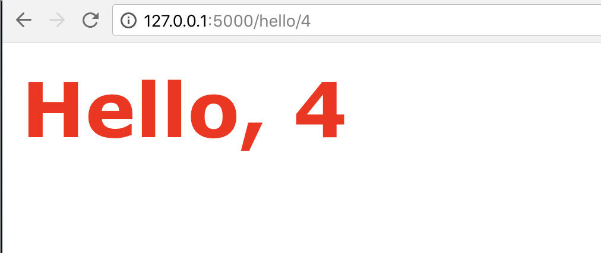

We can have more than one block in a template, and we can also set a default content for that block on the parent template. Let’s do these things to fix an issue we have now with the `<title>` tag.

If you check on the browser’s tab, you’ll see that both the index and the hello pages have the same title: “Index Page”.

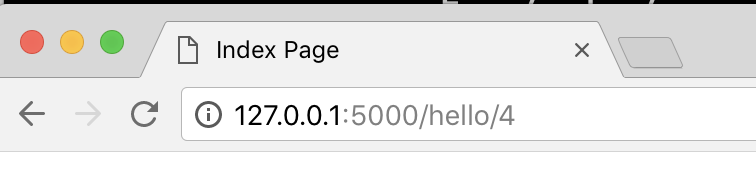

It’s very important that each individual page has its own title, specially when search engines crawl our pages. 

That attribute is set on the `base.html` `<title>` tag. So let’s make this the default to be “Index Page”, if the extending template doesn’t pass it, but something else if it is passed. So  change this line to the following:

{lang=html,line-numbers=on,starting-line-number=3}
```
<title>Index Page</title>
```

Save it[^4] and then open `hello.html` and add the following after the “extends” statement but before the block content:

{lang=html,line-numbers=on,starting-line-number=3}
```
Hello
```

Save the file[^5] and now you’ll notice each page has a different title, as they should.


[^1]:	https://github.com/fromzeroedu/itfc-simple-flask-app/tree/step-14/templates

[^2]:	https://github.com/fromzeroedu/itfc-simple-flask-app/tree/step-15/templates

[^3]:	https://github.com/fromzeroedu/itfc-simple-flask-app/blob/step-16/templates/hello.html

[^4]:	https://github.com/fromzeroedu/itfc-simple-flask-app/blob/step-17/templates/base.html

[^5]:	https://github.com/fromzeroedu/itfc-simple-flask-app/blob/step-17/templates/hello.html

## Introduction to Forms <!-- 3.11 -->
One of the main functionalities an application has is the ability to receive input from its users.

To do this, the HTTP protocol, which is the definition of how web pages work, specifies a set of commands, defined as _verbs_.

There are a number of HTTP verbs that do different operations, but the ones we’ll see in this lesson are `GET` and `POST`.

### The GET Method <!-- 3.11.1 -->
The `GET` method allows you to send the user input from the webpage back to your application using the URL itself.

For example, let’s say we are writing a form the user needs to fill with their first name and last name.

The `GET` URL for that operation could look like this:

```
http://example.com/form?first_name=John&last_name=Smith
```

See how we can see the variables in the URL? The one thing you need to remember is to start the list of field/value pairs, or query parameters, with a question mark.

Flask can read these parameters. Let’s try that.

Head over to `hello.py` and let’s create a new route that will read these parameters from the `GET` request.

Add the following code:

{lang=python,line-numbers=on,starting-line-number=12}
```
@app.route('/form', methods=['GET'])
def form():
    first_name = request.args['first_name']
    last_name = request.args['last_name']
    return f'First Name: {first_name}, Last Name: {last_name}'
```

And in line 1 add `request` to the import list:

{lang=python,line-numbers=on,starting-line-number=1}
```
from flask import Flask, render_template, request
```

Save the file[^1] and then enter this on your browser:

```
http://localhost:5000/form?first_name=John&last_name=Smith
```

You will see the variables have been received properly in the application.

Notice how we added the new `methods` parameter on the route? This is a list of acceptable HTTP methods that can interact with this view. Since we want to read GET parameters, we added the GET method here.

Also notice that we are expecting both values to be present, `first_name` and `last_name`, because we’re using the parameters without a list `get` method, which you shouldn’t confuse with the GET HTTP method.

So for example, if you only pass `first_name` on the parameters in the URL like this:

```
http://localhost:5000/form?first_name=John
```

And hit enter, you’ll get a 400 error (Bad Request). To avoid that you can use:

{lang=python,line-numbers=on,starting-line-number=14}
```
     first_name = request.args.get('first_name')
     last_name = request.args.get('last_name')
```

Save the file[^2], then stop the Flask server and restart, as the contents of the page might have been cached by the browser.

### HTML Forms <!-- 3.11.2 -->
Now of course you don’t expect users to type their first name and last name directly on the URL bar. It would be better to render a nice form for the user.

We can do that using HTML, so let’s create a new template on the templates folder called “form.html”.

An HTML form is defined using the `<form>` open and close tags. Anything inside these tags will be considered part of the form.

So start with:

{lang=html,line-numbers=on,starting-line-number=1}
```
<form>
</form>
```

Next we’ll add our fields, for that we use the `<input>` tags. So let’s add the `first_name` and `last_name` inputs between the form tags.

{lang=html,line-numbers=on,starting-line-number=2}
```
  <input type="text" name="first_name">
  <input type="text" name="last_name">
```

Input has a type, in this case these are “text” fields. There’s other types we’ll see in the course. You also want to add a “name” which is how the variable name will be passed to our application.

In order for the user to actually send the data, we need a button, so add the following:

{lang=html,line-numbers=on,starting-line-number=4}
```
  <input type="submit" name="submit">
```

This looks good, but we’re missing something important. We need to tell the form to which route to send this when the user presses submit. So add the following to the form tag.

{lang=html,line-numbers=on,starting-line-number=1}
```
<form action="/form">
```

But wait, remember I told you to never hardcode any URLs on your  templates? That includes the form actions, so let’s replace that with:

{lang=html,line-numbers=on,starting-line-number=1}
```
<form action="{{ url_for('form') }}">
```

So our whole form looks like this:
```html
<form action="{{ url_for('form') }}">
  <input type="text" name="first_name">
  <input type="text" name="last_name">
  <input type="submit" name="Submit">
</form>
```

Save the `form.html` file[^3] and now head over to`hello.py` and replace the `form` route with the following code:

{lang=python,line-numbers=on,starting-line-number=12}
```
@app.route('/form', methods=['GET'])
def form():
    if request.args.get('submit'):
        first_name = request.args.get('first_name')
        last_name = request.args.get('last_name')
        return f'First Name: {first_name}, Last Name: {last_name}'
    return render_template('form.html')
```

So what’s happening here?

First we check if the query parameter list has a `submit` variable. This only happens after we press the submit button. If we see that, then we read the query parameters `first_name` and `last_name` and print it out in the screen. However, the first time we hit the page, we won’t have the `submit` query parameter, so the `if` condition fails and we render the form template.

Save the file[^4] and stop and start the Flask server, just in case. I’ll explain why we need to do this in a bit.

So now if you head over to `http://localhost:5000/form` you will see the form is rendered.

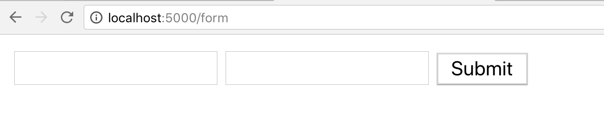

Now enter a first name and last name and press submit. You’ll see the variables printed out.

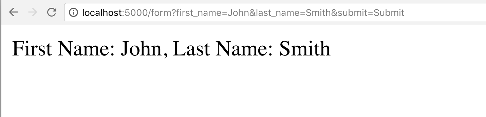

### The POST Method <!-- 3.11.3 -->
The POST method is different from the GET method in a couple of important ways:

- GET sends the data using the URL, POST sends data using the body of the request, so it’s hidden from the user, which makes it better to send sensitive or private data. 
- There’s also a limit to the data you send in GET requests. no limit for POST
- GET requests are cached by the browser, useful to represent  a _state_ of the application, POST requests are not cached by the browser

So let’s change the form to use POST instead of GET, as `first_name` and `last_name` might be sensitive information we don’t want to be passing publicly on the URL.

First we add a `method` parameter to the `form` tag in `form.html`, so that it looks like this:

{lang=python,line-numbers=on,starting-line-number=1}
```
<form action="{{ url_for('form') }}" method="POST">
```

Save the file[^5]. Now we need to modify the route on `hello.py` and add a `POST` method:

{lang=python,line-numbers=on,starting-line-number=11}
```
@app.route('/form', methods=['GET', 'POST'])
```

We leave the `GET` method because the first time you hit the page to render the form, it’s actually a `GET` request.

Now to check if the user submitted data, we change the `if` to read like this:

{lang=python,line-numbers=on,starting-line-number=14}
```
if request.method == 'POST':
```

This condition will only be true when the user presses “Submit” on a form that uses the `POST` method.

Finally, to read the data, we’ll use a different `request` method called `form`:

{lang=python,line-numbers=on,starting-line-number=15}
```
	first_name = request.form.get('first_name')
  last_name = request.form.get('last_name')
```

Save the file[^6] and restart the `flask` server.

Now go to the form URL and notice how when you submit, the values are not displayed on the URL any more.

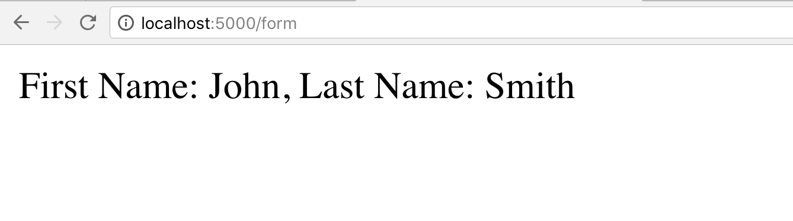

### Using `request.values` <!-- 3.11.4 -->
There’s a third way to read the values of a form, and that’s using `request.values`. 

Just change the two variable assignments to read like this:

{lang=python,line-numbers=on,starting-line-number=15}
```
		first_name = request.values.get('first_name')
    last_name = request.values.get('last_name')
```

Save the file[^7] and restart the server. You should get the same result.

The cool thing about `request.values`is that it reads both `GET` and `POST` data, so you don’t have to use `args` or `form` on the `request` assignment, so that’s convenient.

### Redirects after Form Submits <!-- 3.11.5 -->
When the operation after you hit “Submit” alters the database in any way, it’s not good to allow the user to just hit reload over and over on that page, because that would create multiple identical records.

For example, let’s say the `first_name` and `last_name` in the previous example was to create a new user account. So when we land on the section where we fetch the variables, and a database record is created, a user can then hit reload 100 times and create 100 accounts.

So it’s always good practice to send the user to a “thank you” page after the form is submitted. That way the user can reload that page and nothing happens.

So we could do something like this on the `form` route:

{lang=python,line-numbers=on,starting-line-number=14}
```
if request.method == 'POST':
        first_name = request.values.get('first_name')
        last_name = request.values.get('last_name')
        return redirect(url_for('registered'))
```

That last line will redirect the browser to a route called `registered`. Let’s create that:

{lang=python,line-numbers=on,starting-line-number=20}
```
@app.route('/thank_you')
def registered():
    return 'Thank you!'
```

We need to add both `redirect` and `url_for` to the file, so on line 1 add:

{lang=python,line-numbers=on,starting-line-number=1}
```
from flask import Flask, render_template, request, redirect, url_for
```

Save the file[^8] and hit `/form` on your browser. You will see how after you submit, you’re taken to the new URL `thank_you`. You can reload this page over and over and no new records would be created.

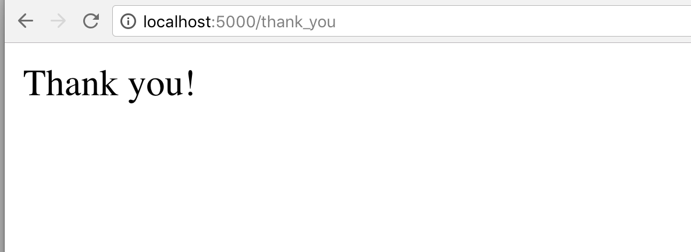

[^1]:	https://github.com/fromzeroedu/itfc-simple-flask-app/blob/step-18/hello.py

[^2]:	https://github.com/fromzeroedu/itfc-simple-flask-app/blob/step-19/hello.py

[^3]:	https://github.com/fromzeroedu/itfc-simple-flask-app/blob/step-20/templates/form.html

[^4]:	https://github.com/fromzeroedu/itfc-simple-flask-app/blob/step-20/hello.py

[^5]:	https://github.com/fromzeroedu/itfc-simple-flask-app/blob/step-21/templates/form.html

[^6]:	https://github.com/fromzeroedu/itfc-simple-flask-app/blob/step-21/hello.py

[^7]:	https://github.com/fromzeroedu/itfc-simple-flask-app/blob/step-22/hello.py

[^8]:	https://github.com/fromzeroedu/itfc-simple-flask-app/blob/step-23/hello.py
