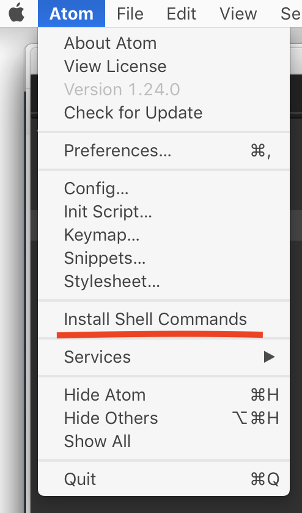
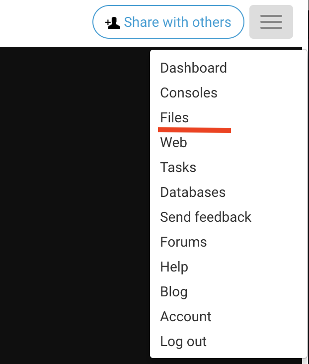
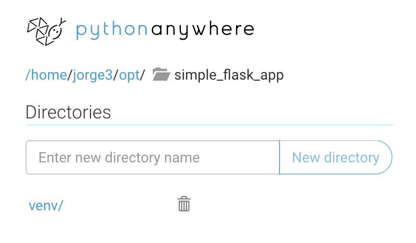
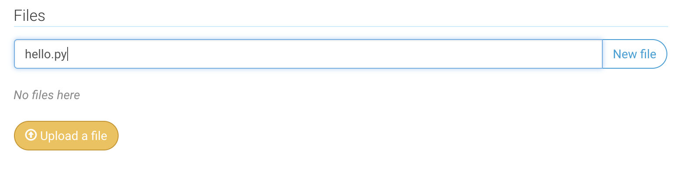
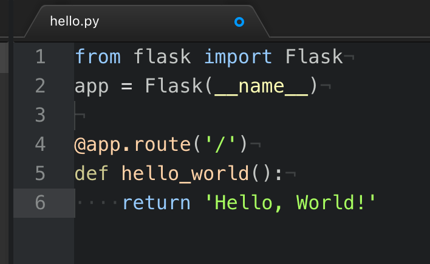

# Say Hello World

## The Code Editor
We’re finally ready to build our first Flask application. Well, it’s not going to be technically an application, but it will introduce us to some fundamental concepts, so that we’re ready to start building real applications.

At this point, if you are working with Mac or Windows, you’re going to need a code editor. If you use PythonAnywhere, don’t worry, you will be using their built-in code editor.

There are many good options for code editors. Some of the most popular include Sublime Text, PyCharm and Visual Studio Code. I definitely recommend to try out some of them when you have the time and see which one you feel most comfortable with.

However, for this course, I’ll be using Atom. Atom is really simple and powerful at the same time and I’ve been using it for some time, so I feel comfortable with it. 

So go ahead and install your code editor and we’ll start building our “Hello World” application next.

## Hello World

So let’s create a file inside our `simple_flask_app` folder. But first, we need to activate our virtual environments.

For Mac, open the terminal and `cd` to `/opt/simple_flask_app`. Then do `source venv/bin/activate` to activate virtualenv.

On Windows do `cd \opt\simple_flask_app`, then do `venv\Scripts\activate`

On PythonAnywhere do `cd ~/opt/simple_flask_app`, then do `workon simple_flask_app`.

From this point on, when I say “activate your virtualenv”, please follow the previous instructions for your current operating system.

Now we’ll create a new file called `hello.py` with our code editor inside the `simple_flask_app` folder.

For Windows and Mac type `atom .`. This will open the Atom editor with this folder selected. 

If you’re on a Mac and that command throws an error like “Atom was not found”, just make sure to quit the Atom application, open it again, and select “Install Shell Commands”.



So how do we create `hello.py`?

On Windows and Mac, select the `simple_flask_app` folder first with your mouse and then hit the `a` key. On the input field type `hello.py`. Note that your folder might have "contracted". Just click it again to expand it and see the contents.

On PythonAnywhere hit the "hamburger" icon on the top right, and select "Files".



Then locate the `opt/` folder on the Directories section, click on it and then click on the `simple_flask_app` link. Make sure you have the full path `/home/` your username, `/opt/simple_flask_app` on the top left.



Finally on the “Files” section, enter “hello.py” and click on the “New file” button.



Okay, we’re ready to start coding our first Flask application!

On the first line type:

{lang=python,line-numbers=on,starting-line-number=1}
```
from flask import Flask
```

This imports the Flask class in our file.

We now need to create an instance of the class. We’ll call that object “app”:

{lang=python,line-numbers=on,starting-line-number=2}
```
app = Flask(__name__)
```

Notice we pass `__name__` as a parameter. This is a Python built-in magic variable that tells Flask which module or package this is running from. This allows Flask to know where to look for related folders of our application.

Leave an empty line and now type:

{lang=python,line-numbers=on,starting-line-number=4}
```
@app.route('/')
```

The @ sign here is called a “decorator”, and essentially this allows us to modify the function we’ll type underneath. We’ll learn more about decorators later on.

The “route” decorator tells Flask what URL this function will be called on. In this case this will be the root folder or “/“.

We now create our function, which just returns “Hello World” back to the browser:

{lang=python,line-numbers=on,starting-line-number=5}
```
def hello_world():
    return 'Hello, World!'
```

And that’s it! This is what the whole file looks like:



In the Atom editor, notice how there’s a little blue circle on the tab? That means this file hasn’t been saved. Hit “CTRL+s” on Windows or “Command+s” on Mac to save it[^1].

On Python Anywhere, notice how it says “unsaved changes” on the top next to the file’s path. Hit the green “Save” button to save the file.

Now we’ll see how to run this application and see it in our browser. We have two different lessons depending if you’re in Windows or Mac, or if you’re in PythonAnywhere. Skip to the one that’s right for you.


[^1]:	https://github.com/fromzeroedu/itfc-simple-flask-app/blob/step-1/hello.py

